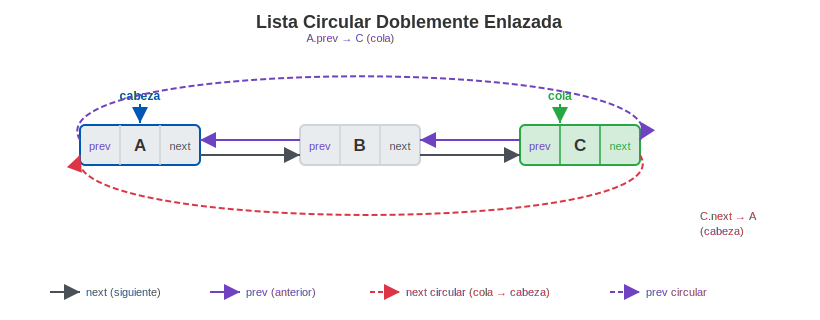
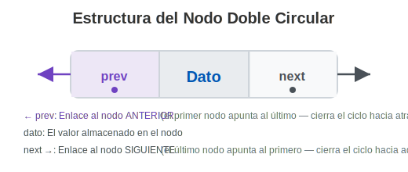
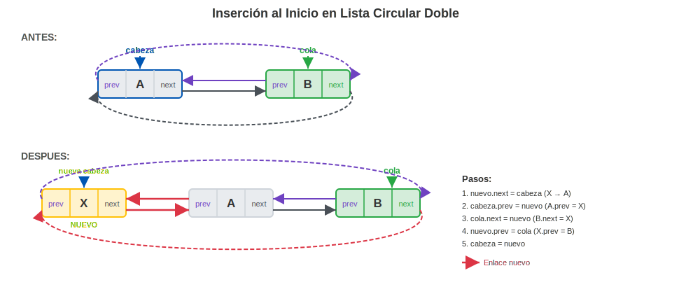
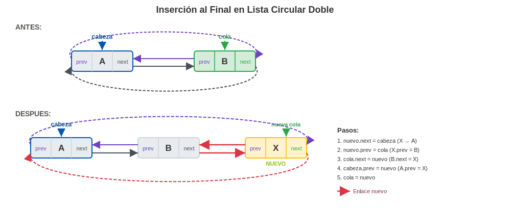
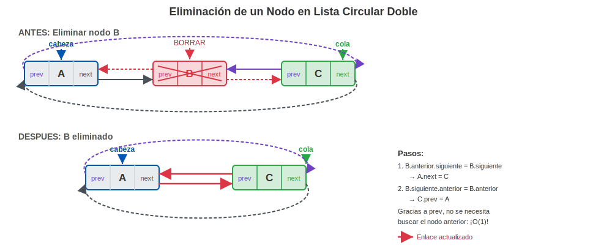
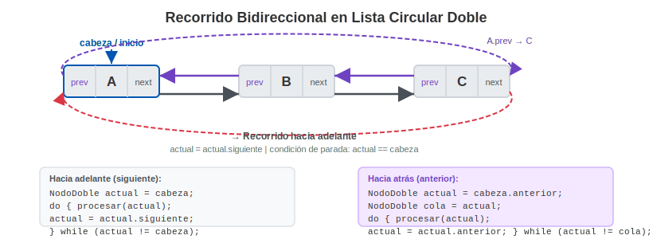

# Semana 9 — Listas Circulares Doblemente Enlazadas
**Asignatura:** Estructura de Datos (IS0018SA) · UPC
**Docente:** Edinson Mauricio Mendoza Espinel
**Unidad 3:** Listas Enlazadas

---

## Tabla de Contenidos
1. [¿Qué es una Lista Circular Doblemente Enlazada?](#1-qué-es-una-lista-circular-doblemente-enlazada)
2. [La Anatomía del Nodo Doble Circular](#2-la-anatomía-del-nodo-doble-circular)
3. [Comparativa de Estructuras de Lista](#3-comparativa-de-estructuras-de-lista)
4. [Ventajas y Desventajas](#4-ventajas-y-desventajas)
5. [Operaciones Principales](#5-operaciones-principales)
6. [Implementación en Java](#6-implementación-en-java)
7. [Ejemplos de Aplicación Real](#7-ejemplos-de-aplicación-real)
8. [Resumen de la Unidad 3](#8-resumen-de-la-unidad-3)

---

## 1. ¿Qué es una Lista Circular Doblemente Enlazada?

Una **Lista Circular Doblemente Enlazada (Circular Doubly Linked List)** combina las características de dos estructuras que ya conocemos:

- De la **Lista Doblemente Enlazada** (Semana 7): cada nodo tiene dos punteros, uno al nodo siguiente (`next`) y otro al nodo anterior (`prev`).
- De la **Lista Circular** (Semana 8): el último nodo **no apunta a `null`**, sino que cierra el ciclo conectándose de vuelta al primero, y el primero también apunta hacia atrás al último.

El resultado es una estructura donde puedes **recorrer en ambas direcciones de forma infinita** sin encontrar nunca un `null`.



> **Clave:** La `cabeza.prev` apunta a la `cola`, y la `cola.next` apunta a la `cabeza`. Ningún puntero es `null`.

---

## 2. La Anatomía del Nodo Doble Circular

Cada nodo de esta estructura tiene **tres componentes**:

| Campo | Tipo | Descripción |
| :--- | :--- | :--- |
| `prev` | Referencia al nodo anterior | Permite moverse hacia atrás en la lista |
| `dato` | Tipo de dato almacenado | La información útil del nodo |
| `next` | Referencia al nodo siguiente | Permite moverse hacia adelante en la lista |



- En una lista con un solo nodo: `nodo.next = nodo` y `nodo.prev = nodo` (se apunta a sí mismo en ambas direcciones).
- En ningún caso un puntero es `null` una vez construida la lista.

---

## 3. Comparativa de Estructuras de Lista

Esta tabla resume toda la evolución de listas que hemos visto en la Unidad 3:

| Característica | Lista Simple (S6) | Lista Doble (S7) | Lista Circular (S8) | **Lista Circular Doble (S9)** |
| :--- | :---: | :---: | :---: | :---: |
| Puntero `next` | ✅ | ✅ | ✅ | ✅ |
| Puntero `prev` | ❌ | ✅ | ❌ | ✅ |
| Sin `null` al final | ❌ | ❌ | ✅ | ✅ |
| Sin `null` al inicio | ❌ | ❌ | ❌ | ✅ |
| Recorrido hacia atrás | ❌ | ✅ | ❌ | ✅ |
| Recorrido infinito bidireccional | ❌ | ❌ | Solo hacia adelante | ✅ |
| Complejidad de implementación | Baja | Media | Media | Alta |

---

## 4. Ventajas y Desventajas

### Ventajas

- **Recorrido bidireccional e infinito:** Puedes recorrer la lista hacia adelante o hacia atrás desde cualquier nodo, sin límites.
- **Eliminación eficiente:** Dado un puntero a cualquier nodo, puedes eliminarlo en O(1) sin necesitar buscar el nodo anterior (gracias a `prev`).
- **Inserción flexible:** Insertar antes o después de cualquier nodo conocido es O(1).
- **Sin extremos muertos:** No hay un inicio o final absoluto; la lista es completamente simétrica.

### Desventajas

- **Mayor uso de memoria:** Cada nodo requiere dos punteros en lugar de uno.
- **Lógica más compleja:** Las operaciones de inserción y eliminación requieren actualizar cuatro punteros (en vez de dos), lo que aumenta el riesgo de errores.
- **Riesgo de bucles infinitos:** Sin una condición de parada correcta, cualquier recorrido puede ejecutarse para siempre.
- **Depuración difícil:** Visualizar y depurar una estructura circular con doble enlace es significativamente más complejo.

---

## 5. Operaciones Principales

### A. Inserción al Inicio



1. Crear el nuevo nodo.
2. **Si la lista está vacía:** El nodo se apunta a sí mismo en ambas direcciones y se convierte en `cabeza` y `cola`.
3. **Si no está vacía:**
   - `nuevo.siguiente = cabeza`
   - `cabeza.anterior = nuevo`
   - `nuevo.anterior = cola`
   - `cola.siguiente = nuevo`
4. Actualizar `cabeza = nuevo`.

### B. Inserción al Final



1. Crear el nuevo nodo.
2. **Si la lista está vacía:** El nodo se apunta a sí mismo en ambas direcciones y se convierte en `cabeza` y `cola`.
3. **Si no está vacía:**
   - `cola.siguiente = nuevo`
   - `nuevo.anterior = cola`
   - `nuevo.siguiente = cabeza`
   - `cabeza.anterior = nuevo`
4. Actualizar `cola = nuevo`.

> **Invariante clave:** La clase siempre mantiene `cola` actualizado explícitamente. `cola.siguiente == cabeza` y `cabeza.anterior == cola` en todo momento.

### C. Eliminación de un Nodo



Dado un nodo a eliminar:

1. **Si es el único nodo:** `cabeza = null` y `cola = null`.
2. Reconectar vecinos:
   - `nodo.anterior.siguiente = nodo.siguiente`
   - `nodo.siguiente.anterior = nodo.anterior`
3. **Si era la `cabeza`:** `cabeza = nodo.siguiente`.
4. **Si era la `cola`:** `cola = nodo.anterior`.

Gracias al puntero `anterior`, **no necesitamos buscar el nodo previo**: lo tenemos directo en O(1).

### D. Recorrido hacia Adelante y hacia Atrás



```java
NodoDoble actual = cabeza;
do {
    System.out.print(actual.dato + " <-> ");
    actual = actual.siguiente;
} while (actual != cabeza);
System.out.println("(cabeza)");
```

**Hacia atrás**, partiendo directamente desde `cola`:

```java
NodoDoble actual = cola;
do {
    System.out.print(actual.dato + " <-> ");
    actual = actual.anterior;
} while (actual != cola);
System.out.println("(cola)");
```

---

## 6. Implementación en Java

### Clase NodoDoble

```java
public class NodoDoble {
    int dato;
    NodoDoble siguiente;
    NodoDoble anterior;

    public NodoDoble(int dato) {
        this.dato = dato;
        this.siguiente = null;
        this.anterior = null;
    }
}
```

### Clase ListaCircularDoble

```java
public class ListaCircularDoble {
    NodoDoble cabeza;
    NodoDoble cola;

    public ListaCircularDoble() {
        this.cabeza = null;
        this.cola = null;
    }

    public void insertarAlFinal(int dato) {
        NodoDoble nuevo = new NodoDoble(dato);
        if (cabeza == null) {
            nuevo.siguiente = nuevo;
            nuevo.anterior = nuevo;
            cabeza = nuevo;
            cola = nuevo;
        } else {
            cola.siguiente = nuevo;
            nuevo.anterior = cola;
            nuevo.siguiente = cabeza;
            cabeza.anterior = nuevo;
            cola = nuevo;
        }
    }

    public void insertarAlInicio(int dato) {
        NodoDoble nuevo = new NodoDoble(dato);
        if (cabeza == null) {
            nuevo.siguiente = nuevo;
            nuevo.anterior = nuevo;
            cabeza = nuevo;
            cola = nuevo;
        } else {
            nuevo.siguiente = cabeza;
            cabeza.anterior = nuevo;
            nuevo.anterior = cola;
            cola.siguiente = nuevo;
            cabeza = nuevo;
        }
    }

    public void eliminar(int valor) {
        if (cabeza == null) return;

        NodoDoble actual = cabeza;
        do {
            if (actual.dato == valor) {
                if (actual.siguiente == actual) {
                    cabeza = null;
                    cola = null;
                    return;
                }
                actual.anterior.siguiente = actual.siguiente;
                actual.siguiente.anterior = actual.anterior;
                if (actual == cabeza) cabeza = actual.siguiente;
                if (actual == cola) cola = actual.anterior;
                return;
            }
            actual = actual.siguiente;
        } while (actual != cabeza);
    }

    public void mostrarAdelante() {
        if (cabeza == null) { System.out.println("Lista vacía"); return; }
        NodoDoble actual = cabeza;
        do {
            System.out.print(actual.dato + " <-> ");
            actual = actual.siguiente;
        } while (actual != cabeza);
        System.out.println("(cabeza)");
    }

    public void mostrarAtras() {
        if (cabeza == null) { System.out.println("Lista vacía"); return; }
        NodoDoble actual = cola;
        do {
            System.out.print(actual.dato + " <-> ");
            actual = actual.anterior;
        } while (actual != cola);
        System.out.println("(cola)");
    }

    public boolean buscar(int valor) {
        if (cabeza == null) return false;
        NodoDoble actual = cabeza;
        do {
            if (actual.dato == valor) return true;
            actual = actual.siguiente;
        } while (actual != cabeza);
        return false;
    }
}
```

### Clase Main — Demostración

```java
public class Main {
    public static void main(String[] args) {
        ListaCircularDoble lista = new ListaCircularDoble();

        lista.insertarAlFinal(10);
        lista.insertarAlFinal(20);
        lista.insertarAlFinal(30);
        lista.insertarAlInicio(5);

        System.out.println("=== Recorrido hacia adelante ===");
        lista.mostrarAdelante();
        // Salida: 5 <-> 10 <-> 20 <-> 30 <-> (cabeza)

        System.out.println("=== Recorrido hacia atrás ===");
        lista.mostrarAtras();
        // Salida: 30 <-> 20 <-> 10 <-> 5 <-> (cola)

        System.out.println("=== Eliminando el 20 ===");
        lista.eliminar(20);
        lista.mostrarAdelante();
        // Salida: 5 <-> 10 <-> 30 <-> (cabeza)

        System.out.println("¿Existe el 10? " + lista.buscar(10)); // true
        System.out.println("¿Existe el 20? " + lista.buscar(20)); // false
    }
}
```

---

## 7. Ejemplos de Aplicación Real

### 1. Navegador Web — Historial de Pestañas

Los navegadores modernos como Chrome o Firefox permiten navegar entre pestañas con `Ctrl+Tab` (siguiente) y `Ctrl+Shift+Tab` (anterior). Las pestañas forman un ciclo: después de la última, vuelves a la primera. Esto es exactamente una lista circular doblemente enlazada: recorrido en ambas direcciones y vuelta al inicio al llegar al final.

### 2. Reproductor de Música en Modo Bucle

Una playlist configurada en modo "repetir todo" con la posibilidad de ir a la canción siguiente o volver a la anterior es un caso clásico. La lista circular doble permite:
- `siguiente()` → avanzar a la próxima canción
- `anterior()` → retroceder a la canción previa
- Al llegar al final, la "siguiente" es la primera canción

### 3. Editor de Texto — Historial de Deshacer/Rehacer

Algunos editores implementan el historial de acciones como una lista doblemente enlazada circular. Cada acción apunta a la anterior (para deshacer) y a la siguiente (para rehacer). La circularidad permite que después de aplicar muchas acciones, el historial pueda ser recorrido de forma continua.

### 4. Sistemas de Caché LRU (Least Recently Used)

El algoritmo de caché **LRU** necesita eliminar el elemento menos recientemente usado cuando la caché está llena. Una lista circular doblemente enlazada combinada con un mapa hash permite realizar esta operación en O(1): la cabeza siempre tiene el elemento más reciente y la cola el menos reciente.

---

## 8. Resumen de la Unidad 3

Hemos completado el estudio de las **Listas Enlazadas**. Aquí un mapa de la evolución:

```
Semana 6: Lista Simple
         [A] → [B] → [C] → null
         Un puntero por nodo. Solo avanza.

Semana 7: Lista Doblemente Enlazada
  null ← [A] ⟺ [B] ⟺ [C] → null
         Dos punteros por nodo. Avanza y retrocede.

Semana 8: Lista Circular Simple
         [A] → [B] → [C] → (A)
         Un puntero por nodo. Ciclo unidireccional.

Semana 9: Lista Circular Doblemente Enlazada
    (C) ← [A] ⟺ [B] ⟺ [C] → (A)
         Dos punteros por nodo. Ciclo bidireccional.
         La estructura más completa y flexible.
```

### Cuándo usar cada una

| Estructura | Úsala cuando... |
| :--- | :--- |
| Lista Simple | Necesitas simplicidad y solo recorres hacia adelante |
| Lista Doble | Necesitas recorrer en ambas sentidos o eliminar eficientemente |
| Lista Circular Simple | Necesitas rotación cíclica (turnos, buffers) |
| **Lista Circular Doble** | Necesitas rotación cíclica **y** recorrido en ambas direcciones |

> **Próximo tema (Semana 12):** Pilas (Stack) — estructuras LIFO construidas sobre los principios que ya dominamos.
