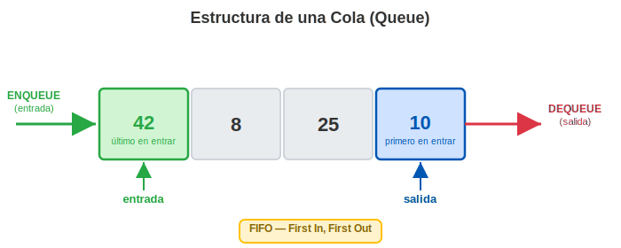
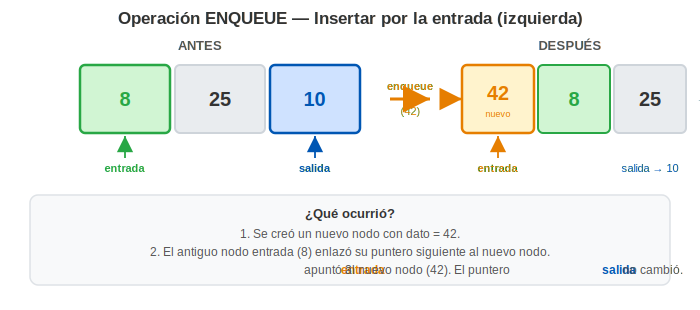
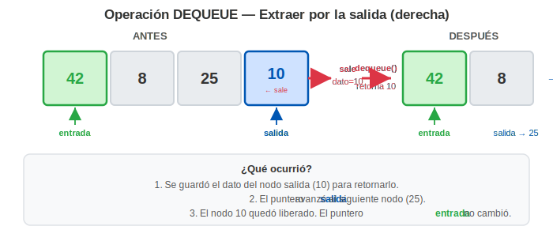

# Semana 13 — Colas (Queue) — Implementación FIFO
**Asignatura:** Estructura de Datos (IS0018SA) · UPC
**Docente:** Edinson Mauricio Mendoza Espinel
**Unidad 4:** Pilas, Colas y Árboles

---

## Tabla de Contenidos
1. [¿Qué es una Cola?](#1-qué-es-una-cola)
2. [El principio FIFO](#2-el-principio-fifo)
3. [Operaciones Fundamentales](#3-operaciones-fundamentales)
4. [Implementación en Java](#4-implementación-en-java)
5. [Aplicaciones Reales](#5-aplicaciones-reales)

---

## 1. ¿Qué es una Cola?

Una **Cola (Queue)** es una estructura de datos **lineal y dinámica** que organiza sus elementos bajo una regla simple: los elementos **entran por un extremo** (el **entrada**) y **salen por el otro** (el **salida**). Nadie puede "colarse" ni saltarse el turno: el orden de llegada determina el orden de atención.



### Analogía

Imagina la fila en una caja de supermercado. La primera persona en llegar es la primera en ser atendida. Cada persona nueva que llega se ubica al final de la fila. Nadie puede ir directamente a la caja sin pasar por la fila. **El primero en entrar a la fila es el primero en salir.** Esa regla es exactamente la esencia de una cola.

### Partes de una Cola

| Concepto | Definición |
| :--- | :--- |
| **Salida** | El extremo de salida; aquí se extraen los elementos |
| **Entrada** | El extremo de entrada; aquí se insertan los elementos nuevos |
| **Vacía** | Estado cuando no hay ningún elemento; `salida == null` |

### Características principales

- **Lineal:** los elementos tienen un orden secuencial claro (de entrada a salida).
- **Dinámica:** puede crecer o decrecer en tiempo de ejecución (con lista enlazada).
- **Acceso restringido:** no se puede acceder a un elemento por su posición. Solo `entrada` y `salida` son los puntos activos.
- **Orden garantizado:** el orden en que los elementos salen es siempre el **mismo** al orden en que entraron.

### Comparación con la Pila

| Característica | Pila (Stack) | Cola (Queue) |
| :--- | :---: | :---: |
| Principio | LIFO | **FIFO** |
| Inserción | Por el tope | Por la entrada |
| Extracción | Por el tope | Por la salida |
| Punteros activos | `tope` (1) | `salida` + `entrada` (2) |

La diferencia clave es que una cola usa **dos punteros**: `entrada` (donde ingresan elementos) y `salida` (donde salen). Una pila solo necesita uno.

---

## 2. El Principio FIFO

**FIFO** son las siglas de **First In, First Out**, que en español significa: **el primer elemento en entrar es el primero en salir**.

### ¿Cómo funciona en la práctica?

Supón que agregas cuatro números a la cola uno por uno: primero el `10`, luego el `25`, luego el `8` y finalmente el `42`. Los elementos entran **por la derecha** y salen **por la izquierda**:

```
DEQUEUE ←  [ 10 ] [ 25 ] [ 8 ] [ 42 ]  ← ENQUEUE
              ↑                    ↑
           salida               entrada
       (primero en salir)   (último en entrar)
```

Ahora, si empiezas a extraer elementos (operación `dequeue`), el orden de salida es el **mismo** al de entrada:

```
1ª extracción → sale 10   (el primero que entró)
2ª extracción → sale 25
3ª extracción → sale  8
4ª extracción → sale 42   (el último que entró, sale de último)
```

| # | Elemento | Acción | Estado de la cola (salida ← → entrada) |
| :---: | :---: | :--- | :--- |
| 1 | `10` | enqueue | `10` |
| 2 | `25` | enqueue | `10 — 25` |
| 3 | `8`  | enqueue | `10 — 25 — 8` |
| 4 | `42` | enqueue | `10 — 25 — 8 — 42` |
| 5 | —    | dequeue → retorna `10` | `25 — 8 — 42` |
| 6 | —    | dequeue → retorna `25` | `8 — 42` |
| 7 | —    | dequeue → retorna `8`  | `42` |
| 8 | —    | dequeue → retorna `42` | *(vacía)* |

La regla es simple: **no tienes opción de elegir qué elemento sale**. Siempre sale el de la `salida`. Esa restricción es lo que hace a la cola ideal para modelar turnos, procesos secuenciales y sistemas de espera.

---

## 3. Operaciones Fundamentales

Una cola expone exactamente **5 operaciones**:

| Operación | Acción | Complejidad |
| :--- | :--- | :---: |
| `enqueue(dato)` | Inserta un elemento por la entrada | **O(1)** |
| `dequeue()` | Extrae y retorna el elemento de la salida | **O(1)** |
| `peek()` | Consulta la salida sin extraerlo | **O(1)** |
| `isEmpty()` | Retorna `true` si la cola está vacía | **O(1)** |
| `size()` | Retorna el número de elementos | **O(1)** |

Todas las operaciones son **O(1)** gracias a los dos punteros (`salida` y `entrada`): no es necesario recorrer la lista para insertar ni para extraer.

### ENQUEUE — Encolar



El nuevo nodo se enlaza al antiguo `entrada`, y el puntero `entrada` avanza al nuevo nodo. El puntero `salida` no cambia.

### DEQUEUE — Desencolar



Se extrae el nodo apuntado por `salida`, el puntero `salida` avanza al siguiente nodo, y se retorna el dato guardado. El puntero `entrada` no cambia. Siempre verificar que la cola no esté vacía antes de hacer `dequeue`.

---

## 4. Implementación en Java

### 4.1 Estructura interna: Lista Enlazada Simple

La Cola se implementa sobre una **Lista Enlazada Simple**: cada nodo guarda un dato y un puntero `siguiente` que apunta al próximo nodo hacia la entrada (del más antiguo al más nuevo). Se mantienen dos punteros externos — `salida` al primer nodo de la cadena (el más antiguo, próximo a salir) y `entrada` al último (el más nuevo, recién insertado) — lo que permite insertar y extraer en **O(1)** sin recorrer la lista.

```
cabeza/salida                          cola/entrada
     ↓                                      ↓
    [10] → [25] → [8] → [42] → null
```

> **¿Por qué la cola inserta por la derecha y no por la izquierda como una lista típica?**
>
> En una lista enlazada simple se suele insertar por la **cabeza** (izquierda), lo que hace que el elemento más nuevo quede siempre a la izquierda. Si además se extrae por la cabeza, el comportamiento es **LIFO** — es decir, una pila.
>
> La cola necesita comportamiento **FIFO**: el primero en entrar debe ser el primero en salir. Para lograrlo, inserta y extrae por **extremos opuestos**: extrae por la cabeza (`salida`, izquierda) e inserta por la cola (`entrada`, derecha). Así el elemento más antiguo siempre está a la izquierda y sale primero.
>
> Mantener un puntero a cada extremo (`salida` y `entrada`) es lo que hace posible que **ambas operaciones sean O(1)**. Sin el puntero `entrada`, insertar al final requeriría recorrer toda la lista — O(n).

La clase `Nodo` de la semana anterior sirve sin modificaciones:

```java
public class Nodo {
    int dato;
    Nodo siguiente;

    public Nodo(int dato) {
        this.dato = dato;
        this.siguiente = null;
    }
}
```

### 4.2 La clase Cola

```java
public class Cola {
    private Nodo salida;   // extremo de salida
    private Nodo entrada;    // extremo de entrada
    private int tamanio;

    public Cola() {
        salida   = null;
        entrada = null;
        tamanio = 0;
    }

    // Verifica si la cola está vacía
    public boolean isEmpty() {
        return salida == null;
    }

    // Retorna el número de elementos
    public int size() {
        return tamanio;
    }

    // Consulta la salida sin extraerlo
    public int peek() {
        if (isEmpty()) {
            throw new RuntimeException("Cola vacía — no hay elemento en salida");
        }
        return salida.dato;
    }

    // Inserta un elemento por la entrada: O(1)
    public void enqueue(int dato) {
        Nodo nuevo = new Nodo(dato);
        if (isEmpty()) {
            salida   = nuevo;   // primer elemento: salida y entrada apuntan al mismo nodo
            entrada = nuevo;
        } else {
            entrada.siguiente = nuevo;  // el antiguo entrada enlaza al nuevo
            entrada = nuevo;            // entrada avanza al nuevo nodo
        }
        tamanio++;
    }

    // Extrae y retorna el elemento de la salida: O(1)
    public int dequeue() {
        if (isEmpty()) {
            throw new RuntimeException("Cola vacía — no se puede desencolar");
        }
        int dato = salida.dato;
        salida = salida.siguiente;   // salida avanza al siguiente nodo
        if (salida == null) {
            entrada = null;           // la cola quedó vacía: también limpiar entrada
        }
        tamanio--;
        return dato;
    }

    // Imprime la cola desde la salida hasta la entrada
    public void imprimir() {
        if (isEmpty()) {
            System.out.println("[ Cola vacía ]");
            return;
        }
        System.out.print("Salida → ");
        Nodo actual = salida;
        while (actual != null) {
            System.out.print(actual.dato);
            if (actual.siguiente != null) System.out.print(" → ");
            actual = actual.siguiente;
        }
        System.out.println(" ← Entrada");
    }
}
```

### 4.3 Clase Main — Prueba de la implementación

```java
public class Main {
    public static void main(String[] args) {
        Cola cola = new Cola();

        System.out.println("=== Encolando elementos ===");
        cola.enqueue(10);
        cola.enqueue(25);
        cola.enqueue(8);
        cola.enqueue(42);
        cola.imprimir();
        // Salida → 10 → 25 → 8 → 42 ← Entrada

        System.out.println("\nSalida actual (peek): " + cola.peek()); // 10
        System.out.println("Tamaño: " + cola.size());                // 4

        System.out.println("\n=== Desencolando elementos ===");
        System.out.println("dequeue() retorna: " + cola.dequeue()); // 10
        System.out.println("dequeue() retorna: " + cola.dequeue()); // 25
        cola.imprimir();
        // Salida → 8 → 42 ← Entrada

        System.out.println("\nNueva salida (peek): " + cola.peek()); // 8
        System.out.println("Tamaño: " + cola.size());               // 2
    }
}
```

### 4.4 Casos borde importantes

| Situación | ¿Qué hacer? |
| :--- | :--- |
| `dequeue()` en cola vacía | Lanzar excepción o retornar valor centinela |
| `enqueue()` en cola vacía | Tanto `salida` como `entrada` deben apuntar al nuevo nodo |
| `dequeue()` hasta dejar la cola vacía | Después de avanzar `salida`, verificar si quedó `null` y limpiar `entrada` también |

El tercer caso es el error más común: si solo se avanza `salida` pero no se limpia `entrada`, el puntero `entrada` queda apuntando a un nodo liberado, lo cual causa bugs en el siguiente `enqueue`.

---

## 5. Aplicaciones en Programación

### 5.1 Sistemas de impresión (cola de trabajos)
Cuando varios usuarios envían documentos a una impresora compartida, cada trabajo se encola. La impresora los procesa en orden de llegada: el primero en enviarse es el primero en imprimirse.

### 5.2 Planificación de procesos en sistemas operativos
El sistema operativo mantiene una cola de procesos listos para ejecutarse. Cuando el procesador queda libre, toma el proceso que lleva más tiempo esperando (el que está en el extremo de salida).

### 5.3 Atención al cliente (call centers / soporte)
Las llamadas entrantes se encolan. El agente disponible atiende siempre la llamada más antigua (extremo de salida). El sistema garantiza equidad: nadie espera indefinidamente si hay agentes disponibles.

### 5.4 Recorrido de árboles en anchura (BFS)
El algoritmo de búsqueda en anchura (Breadth-First Search) usa una cola para explorar los nodos nivel por nivel. Se encolan los hijos del nodo actual y se desencola el siguiente nodo a procesar, garantizando que se visiten todos los nodos de un nivel antes de pasar al siguiente.

---

*Estructura de Datos · IS0018SA · UPC · 2026-1*
