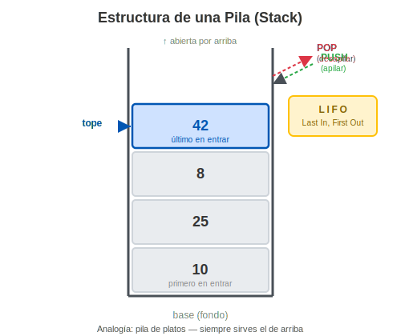
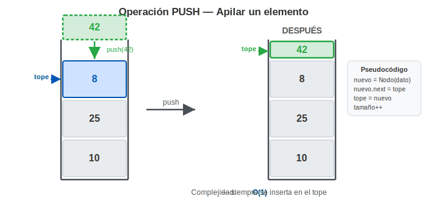
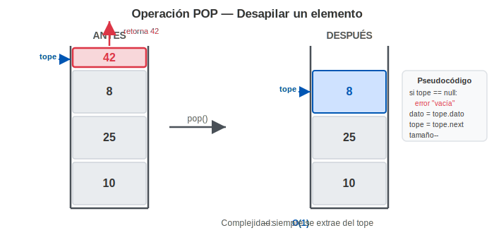

# Semana 12 — Pilas (Stack) — Implementación LIFO
**Asignatura:** Estructura de Datos (IS0018SA) · UPC
**Docente:** Edinson Mauricio Mendoza Espinel
**Unidad 4:** Pilas, Colas y Árboles

---

## Tabla de Contenidos
1. [¿Qué es una Pila?](#1-qué-es-una-pila)
2. [El principio LIFO](#2-el-principio-lifo)
3. [Operaciones Fundamentales](#3-operaciones-fundamentales)
4. [Implementación en Java](#4-implementación-en-java)
5. [Aplicaciones Reales](#5-aplicaciones-reales)

---

## 1. ¿Qué es una Pila?

Una **Pila (Stack)** es una estructura de datos **lineal y dinámica** que organiza sus elementos bajo una regla estricta: solo se puede acceder, insertar o eliminar por **un único extremo**, denominado **tope (top)**. El resto de los elementos permanece inaccesible hasta que los superiores sean retirados.



### Analogía

Imagina una pila de platos sucios en la cocina. Cada plato nuevo que llega se pone encima de todos los demás. Cuando necesitas un plato, tomas el de arriba. **Nunca puedes sacar un plato del medio o del fondo sin antes retirar todos los que están sobre él.** Esa restricción — operar siempre por la cima — es exactamente la esencia de una pila.

### Partes de una Pila

| Concepto | Definición |
| :--- | :--- |
| **Tope (top)** | El único extremo activo; aquí ocurren todas las inserciones y eliminaciones |
| **Base (bottom)** | El fondo de la pila; contiene el primer elemento que entró y el último que saldrá |
| **Vacía** | Estado cuando no hay ningún elemento; `tope == null` |

### Características principales

- **Lineal:** los elementos tienen un orden secuencial claro (de base a tope).
- **Dinámica:** puede crecer o decrecer en tiempo de ejecución (con lista enlazada).
- **Acceso restringido:** **no se puede acceder a un elemento por su posición**. Solo el tope es visible en cada momento.
- **Orden garantizado:** el orden en que los elementos salen es siempre el inverso al orden en que entraron.

### Relación con estructuras anteriores

Una pila no es una estructura completamente nueva — es una **Lista Enlazada Simple con acceso restringido**. Todo lo que aprendiste en la Unidad 3 aplica aquí: los nodos, los punteros `siguiente`, la gestión de la referencia principal. La única diferencia es que en una pila esa referencia principal (el `tope`) es el **único punto de entrada y salida**. Nunca se opera sobre el medio ni sobre la base directamente.

---

## 2. El Principio LIFO

**LIFO** son las siglas de **Last In, First Out**, que en español significa: **el último elemento en entrar es el primero en salir**.

### ¿Cómo funciona en la práctica?

Supón que apilas cuatro números uno por uno: primero el `10`, luego el `25`, luego el `8` y finalmente el `42`. La pila en ese momento tiene a `42` en el tope y a `10` en la base:

```
tope →  [ 42 ]   ← último en entrar
        [  8 ]
        [ 25 ]
base →  [ 10 ]   ← primero en entrar
```

Ahora, si empiezas a extraer elementos (operación `pop`), el orden de salida es exactamente el inverso al de entrada:

```
1° extracción → sale 42   (el último que entró)
2° extracción → sale  8
3° extracción → sale 25
4° extracción → sale 10   (el primero que entró, sale de último)
```

| # | Elemento | Acción | Estado de la pila (tope → base) |
| :---: | :---: | :--- | :--- |
| 1 | `10` | push | `10` |
| 2 | `25` | push | `25 → 10` |
| 3 | `8`  | push | `8 → 25 → 10` |
| 4 | `42` | push | `42 → 8 → 25 → 10` |
| 5 | —    | pop → retorna `42` | `8 → 25 → 10` |
| 6 | —    | pop → retorna `8`  | `25 → 10` |
| 7 | —    | pop → retorna `25` | `10` |
| 8 | —    | pop → retorna `10` | *(vacía)* |

La regla es simple: **no tienes opción de elegir qué elemento sacar**. Siempre sale el del tope, sin excepción. Esa restricción es justamente lo que hace a la pila predecible y poderosa para ciertos problemas.

---

## 3. Operaciones Fundamentales

Una pila expone exactamente **5 operaciones**:

| Operación | Acción | Complejidad |
| :--- | :--- | :---: |
| `push(dato)` | Inserta un elemento en el tope | **O(1)** |
| `pop()` | Extrae y retorna el elemento del tope | **O(1)** |
| `peek()` | Consulta el tope sin extraerlo | **O(1)** |
| `isEmpty()` | Retorna `true` si la pila está vacía | **O(1)** |
| `size()` | Retorna el número de elementos | **O(1)** |

### PUSH — Apilar



El nuevo elemento se convierte en el nuevo tope. El tope anterior queda debajo.

### POP — Desapilar



Se extrae el tope actual y el siguiente elemento se convierte en el nuevo tope. Siempre verificar que la pila no esté vacía antes de hacer `pop`.

---

## 4. Implementación en Java

### 4.1 La clase Nodo

```java
public class Nodo {
    int dato;
    Nodo siguiente;

    public Nodo(int dato) {
        this.dato = dato;
        this.siguiente = null;
    }
}
```

### 4.2 La clase Pila

```java
public class Pila {
    private Nodo tope;
    private int tamanio;

    public Pila() {
        tope = null;
        tamanio = 0;
    }

    // Verifica si la pila está vacía
    public boolean isEmpty() {
        return tope == null;
    }

    // Retorna el número de elementos
    public int size() {
        return tamanio;
    }

    // Consulta el tope sin extraerlo
    public int peek() {
        if (isEmpty()) {
            throw new RuntimeException("Pila vacía — no hay tope");
        }
        return tope.dato;
    }

    // Inserta un elemento en el tope: O(1)
    public void push(int dato) {
        Nodo nuevo = new Nodo(dato);
        nuevo.siguiente = tope;   // el nuevo apunta al tope actual
        tope = nuevo;             // el nuevo se convierte en tope
        tamanio++;
    }

    // Extrae y retorna el elemento del tope: O(1)
    public int pop() {
        if (isEmpty()) {
            throw new RuntimeException("Pila vacía — no se puede desapilar");
        }
        int dato = tope.dato;
        tope = tope.siguiente;    // el tope avanza al siguiente
        tamanio--;
        return dato;
    }

    // Imprime la pila desde el tope hasta la base
    public void imprimir() {
        if (isEmpty()) {
            System.out.println("[ Pila vacía ]");
            return;
        }
        System.out.print("Tope → ");
        Nodo actual = tope;
        while (actual != null) {
            System.out.print(actual.dato);
            if (actual.siguiente != null) System.out.print(" → ");
            actual = actual.siguiente;
        }
        System.out.println(" ← Base");
    }
}
```

### 4.3 Clase Main — Prueba de la implementación

```java
public class Main {
    public static void main(String[] args) {
        Pila pila = new Pila();

        System.out.println("=== Apilando elementos ===");
        pila.push(10);
        pila.push(25);
        pila.push(8);
        pila.push(42);
        pila.imprimir();
        // Tope → 42 → 8 → 25 → 10 ← Base

        System.out.println("\nTope actual (peek): " + pila.peek()); // 42
        System.out.println("Tamaño: " + pila.size());              // 4

        System.out.println("\n=== Desapilando elementos ===");
        System.out.println("pop() retorna: " + pila.pop()); // 42
        System.out.println("pop() retorna: " + pila.pop()); // 8
        pila.imprimir();
        // Tope → 25 → 10 ← Base
    }
}
```

---

## 5. Aplicaciones en Programación

### 5.1 Verificación de paréntesis en código
Cuando el compilador lee una línea como `( [ { } ] )`, usa una pila: cada símbolo de apertura se apila y cada símbolo de cierre se compara con el tope. Si al finalizar la pila está vacía, el código está bien escrito; si queda algo, hay un error de sintaxis.

### 5.2 Conversión de bases numéricas
Para convertir un número decimal a binario, en cada paso se divide entre 2 y el residuo (0 o 1) se apila. Al terminar, se extraen los residuos con `pop` para obtener el resultado en el orden correcto.

### 5.3 Ejecución de funciones (Call Stack)
Cada vez que un método llama a otro, el programa apila la dirección de retorno y las variables locales. Cuando el método termina, se hace `pop` y la ejecución regresa al punto exacto donde se había quedado.

### 5.4 Algoritmos de backtracking
En la resolución de laberintos o puzzles, cada camino explorado se apila. Si se llega a un callejón sin salida, se hace `pop` para retroceder al último punto de decisión y probar otra ruta.

---

*Estructura de Datos · IS0018SA · UPC · 2026-1*
